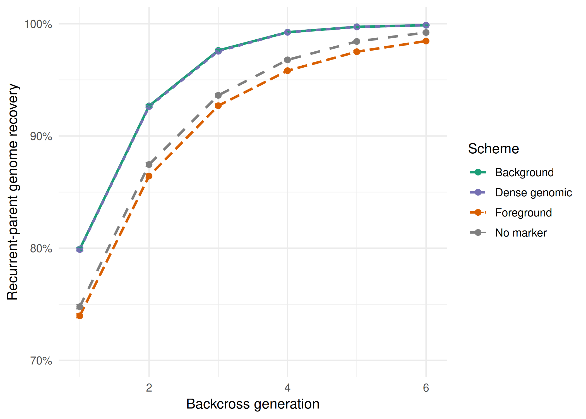
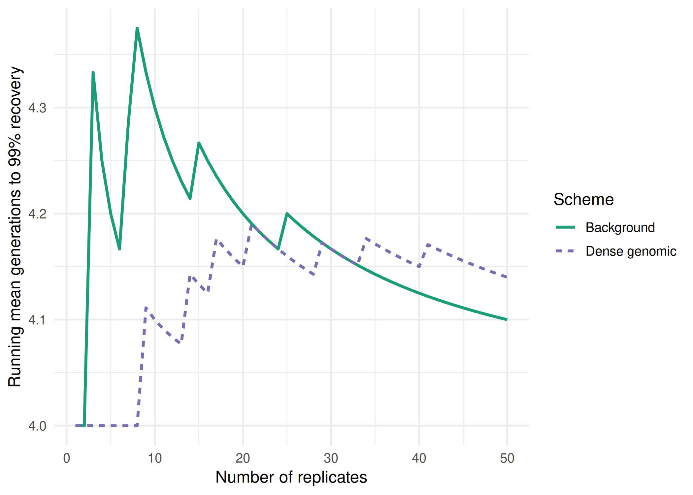
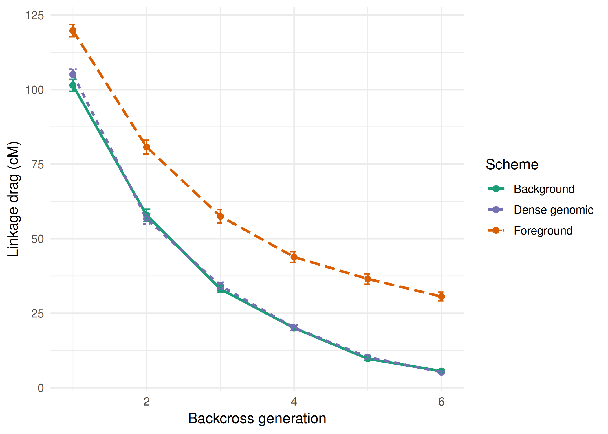
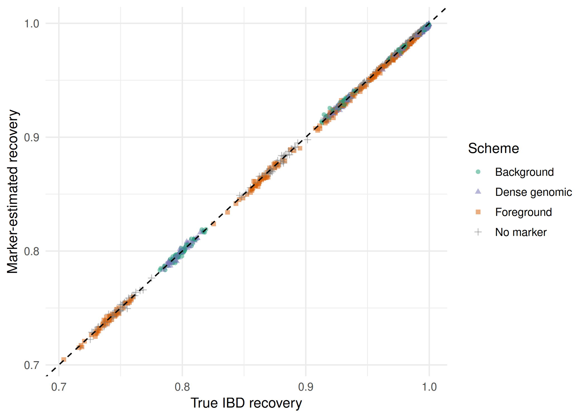
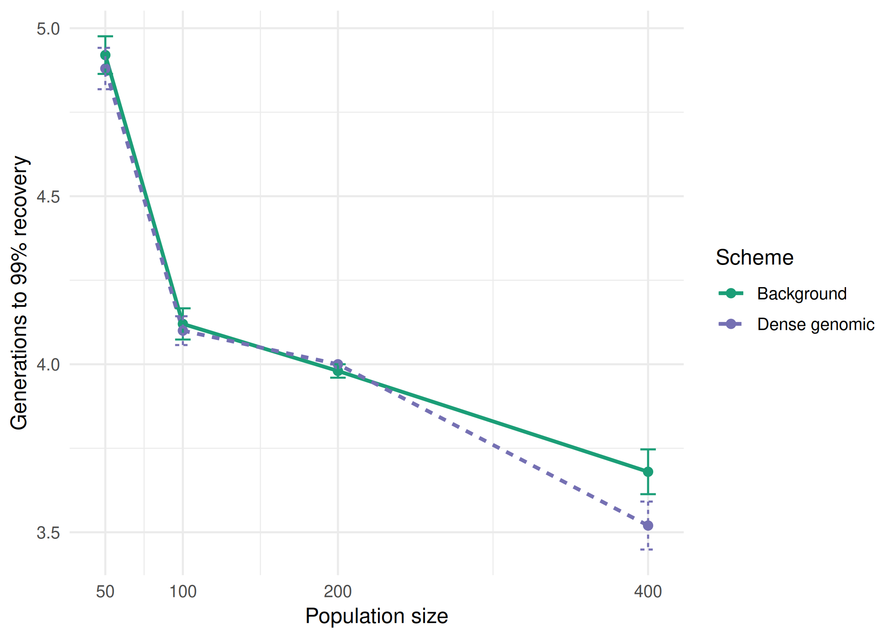
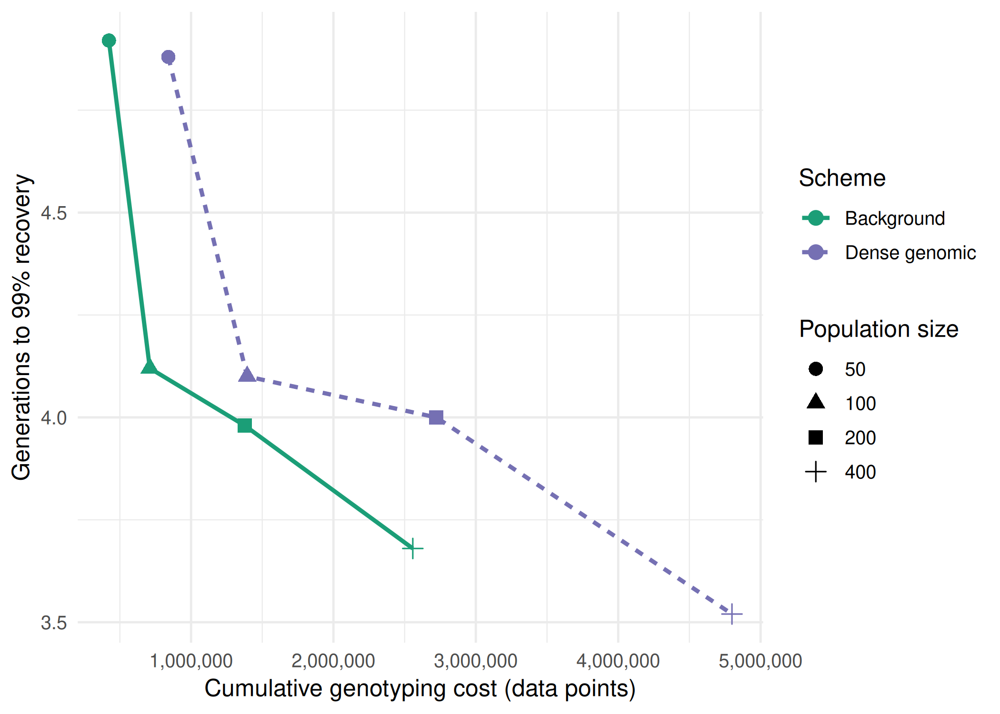
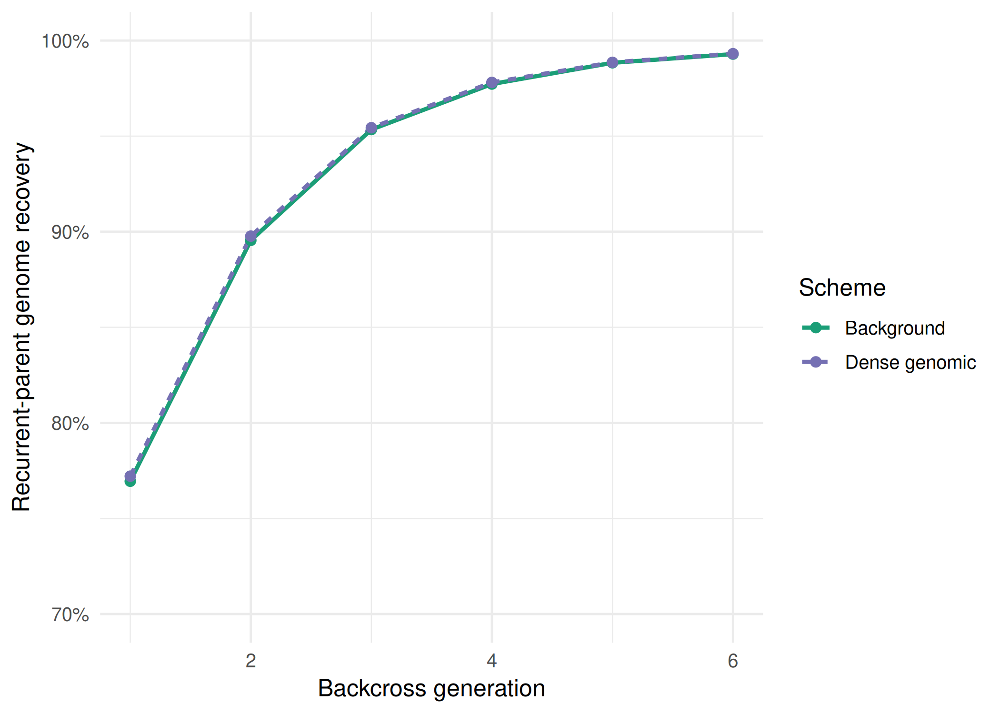

```{r}
#| label: setup

library(dplyr)
library(here)
library(knitr)

read_out <- function(x) readRDS(here("data", "processed", paste0(x, ".rds")))

replicate_runs <- read_out("replicate_runs")
recovery_thresholds <- read_out("recovery_thresholds")
convergence_99 <- read_out("convergence_99")
popsize_thresholds <- read_out("popsize_thresholds")
cost_to_99 <- read_out("cost_to_99")
pyramid_summary <- read_out("pyramid_summary")
pyramid_thresholds <- read_out("pyramid_thresholds")
pyramid_popsize <- read_out("pyramid_popsize")

fmt <- function(x, d = 2) formatC(x, format = "f", digits = d, big.mark = ",")
pct <- function(x, d = 1) paste0(fmt(100 * x, d), "%")
val <- function(df, s, col) df %>% filter(scheme == s) %>% pull(col)

n_reps <- n_distinct(replicate_runs$replicate)
n_gen <- max(replicate_runs$generation)

thr <- recovery_thresholds %>%
  group_by(scheme) %>%
  summarise(
    reached_95 = sum(!is.na(gen_95)),
    mean_gen_95 = mean(gen_95, na.rm = TRUE),
    reached_99 = sum(!is.na(gen_99)),
    mean_gen_99 = mean(gen_99, na.rm = TRUE),
    .groups = "drop"
  )

by_gen <- replicate_runs %>%
  group_by(scheme, generation) %>%
  summarise(
    recovery_ibd = mean(recovery_ibd),
    drag = mean(linkage_drag_cM),
    retention = mean(target_retention),
    .groups = "drop"
  )

first_bc <- by_gen %>% filter(generation == 1)
last_bc <- by_gen %>% filter(generation == n_gen)

expected <- by_gen %>%
  filter(scheme == "No marker") %>%
  mutate(expected = 1 - 0.5^(generation + 1))

gap_max <- replicate_runs %>% summarise(x = max(abs(recovery_gap))) %>% pull(x)

conv_range <- convergence_99 %>%
  filter(replicate > n_reps - 10) %>%
  group_by(scheme) %>%
  summarise(spread = max(running_mean_99) - min(running_mean_99), .groups = "drop")

sweep <- cost_to_99 %>%
  group_by(scheme, pop_size) %>%
  summarise(
    mean_gen_99 = mean(generation),
    mean_cost = mean(cumulative_cost),
    drag_99 = mean(linkage_drag_cM),
    .groups = "drop"
  ) %>%
  left_join(
    popsize_thresholds %>%
      group_by(scheme, pop_size) %>%
      summarise(reached_99 = sum(!is.na(gen_99)), .groups = "drop"),
    by = c("scheme", "pop_size")
  )

sw <- function(s, n, col) sweep %>% filter(scheme == s, pop_size == n) %>% pull(col)

cost_ratio <- sw("Dense genomic", 100, "mean_cost") / sw("Background", 100, "mean_cost")

pyr_thr <- pyramid_thresholds %>%
  group_by(scheme) %>%
  summarise(reached_99 = sum(!is.na(gen_99)), mean_gen_99 = mean(gen_99, na.rm = TRUE), .groups = "drop")

pyr_last <- pyramid_summary %>% filter(generation == max(generation))

req <- function(k, col) pyramid_popsize %>% filter(n_targets == k) %>% pull(col)
```

# Introduction

Marker-assisted backcrossing moves a target allele from a donor line into an elite recurrent parent while the rest of the elite genome is recovered [@collard2008]. A breeder pays for this in two ways. The first is the number of backcross generations needed to recover the recurrent parent genome; the second is the donor segment that stays linked to the target locus, which is known as linkage drag [@young1989; @hospital2001]. Markers can reduce both costs because plants carrying the target can be identified directly (foreground selection) and ranked on how much recurrent parent genome they carry (background selection) [@hospital1992; @visscher1996]. However, genotyping every plant is not free, and the saving in generations has to be set against the number of data points scored [@frisch1999; @morris2003]. In maize, backcrossing has been used to move drought tolerance alleles into elite lines [@ribaut2007].

This project asks how many generations each scheme needs to reach 95% and 99% recurrent parent recovery, how much drag each scheme leaves, how population size changes the time and genotyping cost to 99% recovery, and how adding a second unlinked target changes the population size needed. We start with the reference template and its baseline output. A second part describes the simulated genome, the four schemes and the metrics. Finally, we report the results and discuss what they indicate for scheme choice.

# Methods

## Reference template

The trait introgression script of @bancic2025 was run unchanged as a known reference (`00_reproduce_temp.R`). It uses two chromosomes of 1 Morgan with 11 markers each, places the trait at 0.5 M on chromosome 1, and applies three rounds of backcrossing with foreground selection followed by selfing. The template does not track recovery by generation, does not use background selection, and does not replicate; these three gaps define the additions made in this project.

## Founder genome

A maize-like genome of 10 chromosomes, each about 2 Morgans long, was simulated with `runMacs` in AlphaSimR [@chen2009; @gaynor2021] for 100 individuals with 2,000 segregating sites per chromosome. The target locus (TargetQTL) was added at the centre of chromosome 1 and kept off a 1,000 SNP per chromosome chip, because a chip that includes the target would let background selection see it. Doubled haploids were made from the base population, and the pair of lines with genotype 0 (recurrent parent) and 2 (donor) at the target and the largest SNP distance between them was kept as the two founders. The founders were then imported into a new SimParam with recombination tracking switched on, so that identity-by-descent (IBD) could be read for every locus. The founder seed (50) was also used to fix the chip, because `addSnpChip` draws SNPs at random.

## Backcross schemes

Each run started from a single F1 and backcrossed to the recurrent parent for `r n_gen` generations. Each backcross population had 100 plants and 10 plants were selected as parents of the next generation; population size was held constant because it is the fixed cost a breeder faces. The four schemes differed only in how the 10 plants were chosen. No marker selected plants at random without checking the target. Foreground selected at random among plants carrying the donor allele at the target. Background ranked carriers on the share of recurrent parent alleles at chip SNPs that differ between the two founders. Dense genomic applied the same ranking to every segregating site that differs between the founders, which is the dense marker case. Two other definitions of genomic background recovery exist, a genomic relationship matrix and genomic estimated breeding values for a polygenic trait; neither was run here.

## Metrics

Recovery was computed two ways at every generation. Marker-estimated recovery is the share of recurrent parent alleles at polymorphic chip SNPs, which is what a breeder observes. True recovery is the share of loci whose IBD haplotypes descend from the recurrent parent founder. Linkage drag was measured on the IBD haplotypes of each selected plant as the distance in cM between the nearest loci homozygous for recurrent parent IBD on each side of the target; a chromosome end was used when no such locus existed on that side. Genotyping cost was counted as data points, that is the target locus scored on every plant plus the polymorphic loci scored on carriers.

## Replication, population size and pyramiding

Each scheme was run for `r n_reps` seeded replicates (seeds 1001 to 1050). The replicate count was checked with a running mean of generations to 99% recovery. Background and Dense genomic were then run at 50, 100, 200 and 400 plants per generation, with 10 plants selected at every size (seeds 2001 to 2050); the selected proportion therefore fell from 20% to 2.5%. For pyramiding, a second target (TargetQTL2) was placed at the centre of chromosome 5, and foreground selection required a donor allele at both targets (seeds 3001 to 3050). The population size needed for pyramiding was taken as the smallest population that gives at least 10 carriers with 99% probability under a binomial draw at the expected carrier rate. Analyses used R with the tidyverse [@wickham2019].

# Results

## Reference template

In the template, most BC3F2 plants carried between 70% and 95% recurrent parent genome (@fig-baseline). Marker M6, which sits at the trait position, was fixed for the donor allele, while M3 to M9 on chromosome 1 carried lower recovery than the markers on chromosome 2. This pattern is expected because only chromosome 1 carries the target; flanking donor segments are held there by foreground selection.

```{r}
#| label: fig-baseline
#| fig-cap: "Template output for BC3F2 plants: (a) distribution of recurrent parent IBD per plant; (b) IBD by marker."
#| fig-subcap: ["", ""]
#| layout-ncol: 2

include_graphics(c("baseline_figures/plot 1.png", "baseline_figures/plot 2.png"))
```

## Recurrent parent recovery

Background and Dense genomic recovered the recurrent parent genome faster than Foreground and No marker from the first backcross (@fig-recovery). At generation 1, mean true recovery was `r pct(val(first_bc, "Background", "recovery_ibd"))` for Background and `r pct(val(first_bc, "Dense genomic", "recovery_ibd"))` for Dense genomic, against `r pct(val(first_bc, "Foreground", "recovery_ibd"))` for Foreground. Both background schemes reached 99% recovery in every replicate, at a mean of `r fmt(val(thr, "Background", "mean_gen_99"))` and `r fmt(val(thr, "Dense genomic", "mean_gen_99"))` generations (@tbl-thresholds). Foreground reached 99% in only `r val(thr, "Foreground", "reached_99")` of `r n_reps` replicates within `r n_gen` generations. Background reached 95% `r fmt(val(thr, "Foreground", "mean_gen_95") - val(thr, "Background", "mean_gen_95"))` generations earlier than Foreground on average. This suggests that background selection saves at least one backcross generation at 95% and more at 99%, which is consistent with @hospital1992.

```{r}
#| label: fig-recovery
#| fig-cap: "Mean true recurrent parent recovery by backcross generation. Error bars are one standard error over replicates."


```

```{r}
#| label: tbl-thresholds
#| tbl-cap: "Replicates reaching 95% and 99% true recovery, and the mean first generation at which each threshold was reached."

thr %>%
  mutate(across(starts_with("mean"), \(x) fmt(x))) %>%
  kable(col.names = c("Scheme", "Reached 95%", "Mean generation (95%)", "Reached 99%", "Mean generation (99%)"))
```

No marker reached 99% in more replicates (`r val(thr, "No marker", "reached_99")`) than Foreground. However, only `r pct(val(last_bc, "No marker", "retention"))` of No marker plants still carried the target allele at generation `r n_gen`. Its faster recovery therefore appears to come from losing the target allele together with the donor segment around it. Its recovery also followed the expected value of 1 − 0.5^(t+1) closely (`r pct(val(expected %>% filter(generation == n_gen), "No marker", "recovery_ibd"))` observed against `r pct(val(expected %>% filter(generation == n_gen), "No marker", "expected"))` expected at generation `r n_gen`), which supports the simulation behaving as a random backcross [@stam1981].

The running mean of generations to 99% changed by at most `r fmt(max(conv_range$spread), 3)` generations over the last 10 replicates (@fig-convergence). Hence `r n_reps` replicates appear sufficient for this threshold.

```{r}
#| label: fig-convergence
#| fig-cap: "Running mean of generations to 99% recovery as replicates are added."


```

## Linkage drag

Foreground left the largest donor segment around the target (@fig-drag). At generation `r n_gen`, mean drag was `r fmt(val(last_bc, "Foreground", "drag"), 1)` cM under Foreground, against `r fmt(val(last_bc, "Background", "drag"), 1)` cM under Background and `r fmt(val(last_bc, "Dense genomic", "drag"), 1)` cM under Dense genomic. Background selection likely reduced drag because plants with recombination close to the target carry more recurrent parent alleles on chromosome 1 and are ranked higher [@hospital2001]. No marker is not shown; its low drag reflects loss of the target allele.

```{r}
#| label: fig-drag
#| fig-cap: "Mean linkage drag around the target locus by backcross generation. Error bars are one standard error over replicates."


```

## Marker-estimated against true recovery

Marker-estimated recovery and true IBD recovery differed by at most `r fmt(gap_max, 4)` in any replicate and generation (@fig-marker-ibd). This indicates that a 1,000 SNP per chromosome chip, restricted to loci polymorphic between the founders, tracks true recovery closely on this genome.

```{r}
#| label: fig-marker-ibd
#| fig-cap: "Marker-estimated recovery against true IBD recovery for every replicate and generation. The dashed line marks equality."


```

## Population size and genotyping cost

Larger populations reduced the number of generations to 99% recovery (@fig-popsize). For Background, the mean fell from `r fmt(sw("Background", 50, "mean_gen_99"))` generations at 50 plants to `r fmt(sw("Background", 400, "mean_gen_99"))` at 400 plants. The cumulative cost rose from `r fmt(sw("Background", 50, "mean_cost"), 0)` to `r fmt(sw("Background", 400, "mean_cost"), 0)` data points over the same range (@fig-cost, @tbl-sweep). Dense genomic needed a similar number of generations but about `r fmt(cost_ratio, 1)` times the cost of Background at 100 plants, because it scores every polymorphic segregating site. Based on these values, Background appears to give the same recovery as Dense genomic at a lower cost, and the gain from populations above 100 plants is small against the added cost.

```{r}
#| label: fig-popsize
#| fig-cap: "Mean generations to 99% recovery by population size. Error bars are one standard error over replicates."


```

```{r}
#| label: fig-cost
#| fig-cap: "Mean generations to 99% recovery against cumulative genotyping cost up to that generation."


```

```{r}
#| label: tbl-sweep
#| tbl-cap: "Population size sweep: replicates reaching 99%, mean generation to 99%, cumulative genotyping cost (data points) and linkage drag at that generation."

sweep %>%
  transmute(
    Scheme = scheme,
    `Population size` = pop_size,
    `Reached 99%` = reached_99,
    `Mean generation` = fmt(mean_gen_99),
    `Mean cost` = fmt(mean_cost, 0),
    `Drag (cM)` = fmt(drag_99, 1)
  ) %>%
  kable()
```

## Pyramiding two targets

With two unlinked targets, the share of plants carrying both donor alleles was `r pct(req(2, "observed_rate"))`, against `r pct(req(1, "observed_rate"))` for one target. As a result, the population needed to secure 10 carriers with 99% probability rose from `r req(1, "required_pop_size")` to `r req(2, "required_pop_size")` plants. At 100 plants, Background reached 99% recovery in `r val(pyr_thr, "Background", "reached_99")` of `r n_reps` replicates at a mean of `r fmt(val(pyr_thr, "Background", "mean_gen_99"))` generations (@fig-pyramid), against `r fmt(val(thr, "Background", "mean_gen_99"))` generations for one target. Fewer carriers leave less room to select on background, which likely explains the slower recovery. At generation `r n_gen`, drag under Background was `r fmt(val(pyr_last, "Background", "linkage_drag_cM"), 1)` cM at TargetQTL and `r fmt(val(pyr_last, "Background", "linkage_drag_cM_2"), 1)` cM at TargetQTL2, against `r fmt(val(last_bc, "Background", "drag"), 1)` cM with one target.

```{r}
#| label: fig-pyramid
#| fig-cap: "Mean true recurrent parent recovery by backcross generation when pyramiding two unlinked targets."


```

# Discussion

Background selection on a polymorphic SNP chip shortened the backcross programme and left less drag around the target than foreground selection alone. These findings backed up those of @hospital1992 and @frisch1999, who reported that marker background selection reduces the generations needed to recover the recurrent parent. Dense genomic did not clearly improve recovery over the chip in this setting. This is likely because the chip estimate already matched true IBD recovery closely; again, extra markers had little error left to correct. Hence, the chip scheme is expected to be the more efficient choice where genotyping is paid per data point.

Population size behaved as a cost question. Larger populations gave more carriers to rank and fewer generations, though the saving between 100 and 400 plants was `r fmt(sw("Background", 100, "mean_gen_99") - sw("Background", 400, "mean_gen_99"))` generations while the cost rose `r fmt(sw("Background", 400, "mean_cost") / sw("Background", 100, "mean_cost"), 1)` times. The choice therefore likely depends on whether a generation of time is worth more than the added genotyping, which is consistent with the trade-off described by @morris2003 for maize line conversion.

Pyramiding two unlinked targets roughly doubled the population needed to keep 10 carriers and slowed recovery at a fixed population of 100 plants. Requiring both donor alleles halves the pool of carriers, so background selection ranks fewer plants in each generation [@hospital1997; @frisch2005].

Some limits apply to these results. The target was placed at the centre of chromosome 1; a telomeric position is expected to leave less drag, so the drag values are partly a result of that choice. The foreground marker is the target locus itself with no genotyping error, and cost counts data points only, not field or laboratory costs. The number of selected plants was fixed at 10, so the selected proportion changed across the population size sweep. Two linked targets in repulsion were not run, because the population sizes grow quickly and the result turns on recombination between the loci, which would need its own analysis [@hospital2005].

# References

::: {#refs}
:::
